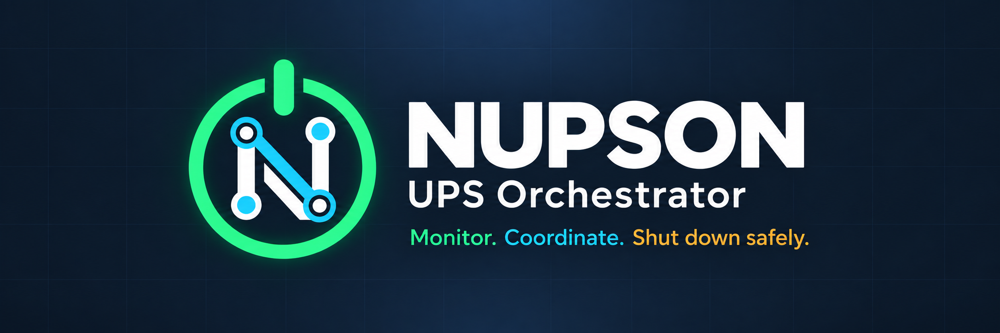

# NUPSON



NUPSON is a self-hosted Network UPS Tools appliance for a USB-connected UPS. It
provides a protected NUT server, a responsive monitoring dashboard, controlled
client shutdown configuration, and ordered Wake-on-LAN recovery after power
returns.

## What it does

- detects and configures a supported USB UPS through NUT;
- exposes UPS data to trusted `upsmon` clients on TCP 3493;
- records power events and historical telemetry in SQLite;
- generates ready-to-install NUT client configuration bundles;
- confirms that utility power remains continuously available after an outage;
- waits for a configured battery reserve before waking machines;
- checks hosts and runs Wake-on-LAN in ordered waves;
- sends human-readable webhook and Discord notifications;
- runs without `privileged: true` or access to the Docker socket.

NUPSON does not electrically stabilize power. Its recovery timer only verifies
that utility power has not disappeared again for the configured interval.

## Requirements

- Linux with Docker Engine and Docker Compose v2;
- a USB UPS supported by [Network UPS Tools](https://networkupstools.org/);
- a trusted LAN that can carry Wake-on-LAN broadcasts;
- a dedicated host group and udev rule for the UPS device.

## Quick start

Identify the UPS first:

```bash
lsusb
```

Create a dedicated group and print its numeric GID:

```bash
sudo groupadd --system nupson-usb
getent group nupson-usb
```

Create `/etc/udev/rules.d/99-nupson-ups.rules`, replacing the example vendor and
product IDs with the values reported by `lsusb`:

```udev
SUBSYSTEM=="usb", ATTR{idVendor}=="0764", ATTR{idProduct}=="0501", GROUP="nupson-usb", MODE="0660"
```

Reload the rules, trigger udev, and physically reconnect the UPS:

```bash
sudo udevadm control --reload-rules
sudo udevadm trigger
```

Then prepare NUPSON:

```bash
cp .env.example .env
```

Set `NUPSON_USB_GID` in `.env` to the GID printed by `getent`. Also set
`NUPSON_UID` and `NUPSON_GID` to the values printed by `id -u` and `id -g` so
the bind-mounted `data/` directory remains owned by your host account. Then
start the service:

```bash
docker compose up -d --build
docker compose logs -f nupson
```

Open `http://HOST:8480`, create the administrator account, detect the UPS, and
add Wake-on-LAN hosts. There is no default password.

The complete setup, permission verification, firewall, upgrade, backup, and
troubleshooting instructions are in [Installation and operations](docs/installation.md).

## Demo mode

The image can run without UPS hardware:

```bash
docker run --rm -p 8480:8080 \
  -e NUPSON_DEMO=true \
  -e NUPSON_MANAGE_NUT=false \
  ghcr.io/OWNER/REPOSITORY:latest
```

Replace `OWNER/REPOSITORY` with this repository path. Demo mode must not be used
to protect real systems.

## Container images and releases

Images are published to GitHub Container Registry only when a GitHub Release is
published. Pushes and pull requests never publish an image.

| Release target | Release tag | Image tags |
| --- | --- | --- |
| `main` | `X.Y.Z`, for example `1.2.3` | `X.Y.Z`, `latest` |
| `dev` | `devX.Y.Z`, for example `dev1.2.3` | `devX.Y.Z`, `dev_latest` |

Both image variants are built for `linux/amd64` and `linux/arm64`. Stable and
development tags never overwrite each other.

To deploy a published image, set `NUPSON_IMAGE` in `.env`, for example:

```dotenv
NUPSON_IMAGE=ghcr.io/OWNER/REPOSITORY:1.2.3
```

Then run `docker compose pull && docker compose up -d`. GitHub Container
Registry packages are private on first publication unless their package
visibility is changed; make the package public for anonymous pulls from a public
project.

## Local development

NUPSON has no Python runtime dependency outside the standard library:

```bash
python3 -m unittest discover -s tests -v
NUPSON_MANAGE_NUT=false NUPSON_DEMO=true python3 -m nupson.app
```

Pull-request CI runs Ruff, unit tests, and Compose validation. Image builds are
reserved for published releases.

## Security and persistent data

The `data/` directory contains the SQLite database, password hashes, sessions,
NUT credentials, and generated configuration. It is excluded from Git and must
never be published. The container aligns its unprivileged `nut` account with
`NUPSON_UID:NUPSON_GID`; set these to the numeric owner of `data/`. Database
files are restricted to mode `0600`. `.env` is also excluded; only
`.env.example` belongs in the repository.

The default Compose configuration uses host networking for Wake-on-LAN. Limit
the dashboard port and TCP 3493 to trusted networks with the host firewall.

## Documentation

- [Installation and operations](docs/installation.md)
- [NUT client configuration](docs/nut-clients.md)
- [Webhook notifications](docs/webhooks.md)
- [Architecture](docs/architecture.md)
- [Implementation plan](IMPLEMENTATION_PLAN.md)
- [Changelog](changelog.md)
- [Contributing](CONTRIBUTING.md)
- [Security policy](SECURITY.md)

## License

NUPSON is distributed under the [MIT License](LICENSE).
